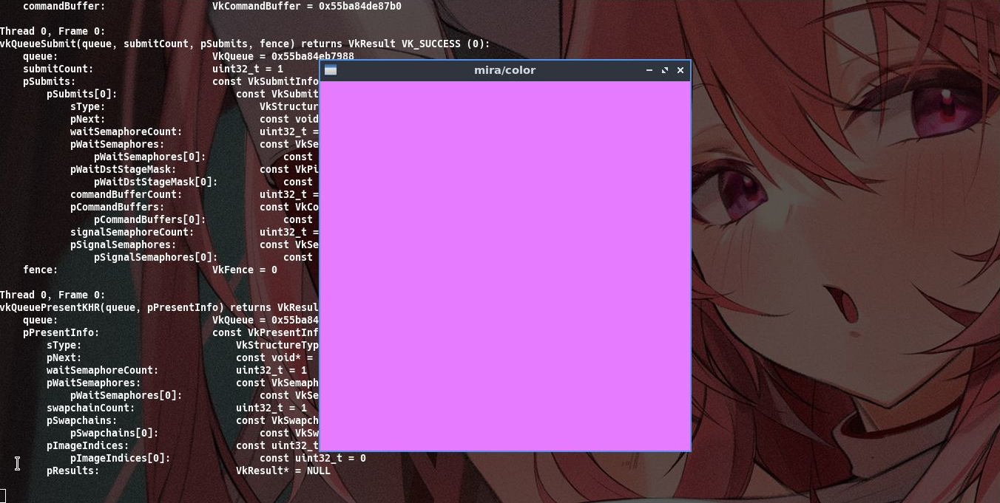

# mira
[](https://crates.io/crates/mira)
[](https://docs.rs/mira)
[](https://www.apache.org/licenses/LICENSE-2.0)

Pure and simple Vulkan bindings generated from Vulkan-Headers!

Mira provides a simple and straightforward way to interact with Vulkan.
Everything was generated by bindgen and uses the original API names.
This crate provides:
* 👀 Function pointers!
* 💯 Dynamic loader of instance and device commands!
* ✍️  Original names of commands, structures and macros!
* 💪 Extra useful features to help with development!
* 😀 Simple examples!


## Code
Enumerate all instance extensions.

```rust
use mira::loader;
use mira::mem::{zeroed_vec, from_cstring};
use mira::vulkan::*;
use const_cstr::*;

fn main() {
    let eip:PFN_vkEnumerateInstanceExtensionProperties = unsafe {
        loader::instance(std::ptr::null_mut(), const_cstr!("vkEnumerateInstanceExtensionProperties"))
    };

    let mut count = 0 as u32;

    unsafe { (eip)(std::ptr::null_mut(), &mut count, std::ptr::null_mut()); }
    let mut extensions = unsafe { zeroed_vec(count as usize) };

    unsafe { (eip)(std::ptr::null_mut(), &mut count, extensions.as_mut_ptr()); }

    println!("Instance extensions");
    for extension in extensions.iter().enumerate() {
        let str = match unsafe { from_cstring(extension.1.extensionName.as_ptr()) } {
            Ok(str) => str,
            Err(_) => continue,
        };

        println!("extension #{} - {}", extension.0, str);
    }
}
```

## Examples
Successfully tested on Linux(Lubuntu 20.04) with Intel(R) HD Graphics 620 (KBL GT2).

### Color
Displays a window with a purple background.
>cargo run --example color



## Vulkan version
1.2.189.0

## License
[Apache 2.0](https://www.apache.org/licenses/LICENSE-2.0)
